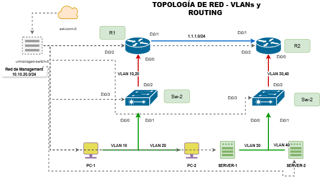

# 📡 Documentación de Infraestructura de Red 

---
### 📊 Topologia de la red 

Esta red esta diseñada con la arquitectura de core colapsado  (Acceso,Distribucion/Core,routers de borde) garantizado tolerancia a fallos.

---
### Descripción de la Topología

| **Elemento** | **Descripción** |                                      |
|--------------|-----------------|                                      |
| **R1**       | Router principal - Gateway de VLANs 10 y 20 + NAT/DHCP |
| **R2**       | Router secundario - Gateway de VLANs 30 y 40 + DHCP    |
| **SW1**      | Switch de acceso - VLANs 10 (PC1) y 20 (Server1)       |
| **SW2**      | Switch de acceso - VLANs 30 (PC2) y 40 (Server2)       |
| **PC1**      | Cliente en VLAN 10                                     |                                |
| **PC2**      | Cliente en VLAN 20                                     |                             
| **Server1**  | Servidor en VLAN 20 (Ventas)                           |
| **Server2**  | Servidor en VLAN 40 (Desarrollo)                       |

---

## 🌐 Direccionamiento IP

### Tabla General de Dispositivos

 Dispositivo   Interfaz        Dirección IP     Máscara          Gateway       VLAN  Descripción
 --------------------------------------------------------------------------------------------------------
 R1            Ethernet0/2     10.10.20.171     255.255.255.0    10.10.20.254  -     Management (CML)
               Ethernet0/0.10  192.168.10.1     255.255.255.0    -             10    Gateway VLAN 10
               Ethernet0/0.20  192.168.20.1     255.255.255.0    -             20    Gateway VLAN 20
               Ethernet0/1     1.1.1.1          255.255.255.0    -             -     Enlace a R2

 R2            Ethernet0/2     10.10.20.172     255.255.255.0    10.10.20.254  -     Management (CML)
               Ethernet0/0.30  192.168.30.1     255.255.255.0    -             30    Gateway VLAN 30
               Ethernet0/0.40  192.168.40.1     255.255.255.0    -             40    Gateway VLAN 40
               Ethernet0/1     1.1.1.2          255.255.255.0    -             -     Enlace a R1

 SW1           Ethernet0/3     10.10.20.173     255.255.255.0    10.10.20.254  -     Management (CML)
               VLAN 10         -                -                192.168.10.1  10    Management VLAN
               VLAN 20         -                -                192.168.20.1  20    Management VLAN

 SW2           Ethernet0/3     10.10.20.174     255.255.255.0    10.10.20.254  -     Management (CML)
               VLAN 30         -                -                192.168.30.1  30    Management VLAN
               VLAN 40         -                -                192.168.40.1  40    Management VLAN

 PC1           eth1            10.10.20.177     255.255.255.0    10.10.20.254  -     Management
 PC2           eth1            10.10.20.178     255.255.255.0    10.10.20.254  -     Management
 Server1       eth1            10.10.20.175     255.255.255.0    10.10.20.254  -     Management
 Server2       eth1            10.10.20.176     255.255.255.0    10.10.20.254  -     Management

---

## 📊 VLANs y Subredes

| **VLAN ID** | **Nombre** | **Subred IPv4** | **Subred IPv6** | **Gateway IPv4** | **Gateway IPv6** | **Dispositivos** |
|-------------|------------|-----------------|-----------------|------------------|------------------|------------------|
| 10 | ADMIN | 192.168.10.0/24 | 2001:db8:acad:10::/64 | 192.168.10.1 | 2001:db8:acad:10::1 | PC1, SW1 |
| 20 | VENTAS | 192.168.20.0/24 | 2001:db8:acad:20::/64 | 192.168.20.1 | 2001:db8:acad:20::1 | Server1, SW1 |
| 30 | IT | 192.168.30.0/24 | 2001:db8:acad:30::/64 | 192.168.30.1 | 2001:db8:acad:30::1 | PC2, SW2 |
| 40 | DESARROLLO | 192.168.40.0/24 | 2001:db8:acad:40::/64 | 192.168.40.1 | 2001:db8:acad:40::1 | Server2, SW2 |
| 90 | NATIVA | - | - | - | - | Native VLAN (Trunk) |
| 120 | BLACKHOLE | - | - | - | - | Puertos no utilizados |

---

## ⚙️ Configuraciones en Común

### Aplicado a TODOS los dispositivos (Switches y Routers)

| **Parámetro** | **Valor** |
|---------------|-----------|
| **Usuario** | `cisco` |
| **Password** | `cisco` |
| **Enable Secret** | `cisco` |
| **Dominio** | `local.com` |
| **SSH Version** | 2 |
| **Key RSA** | 2048 bits |
| **Transport Input** | SSH (no Telnet) |
| **Logging Console** | Deshabilitado (`no logging console`) |
| **Spanning Tree** | Rapid-PVST |
| **Cifrado de Contraseñas** | `service password-encryption` |

## 🔧 Configuraciones de Switches de Acceso

#### 1. Configuración Base (Común a todos los switches)

- ✅ Hostname asignado según ubicación
- ✅ IP de management configurada en VLAN correspondiente
- ✅ Gateway por defecto definido
- ✅ Usuario local con privilegios configurado
- ✅ SSH habilitado con autenticación local
- ✅ Contraseñas encriptadas con `service password-encryption`
- ✅ Spanning Tree en modo Rapid-PVST
- ✅ Logging configurado para monitoreo

---

#### ✅ Configuraciones en Switches de Acceso

**Configuraciones Generales:**
- ✅ Hostname asignado según dispositivo
- ✅ Enable secret configurado
- ✅ VLANs creadas y nombradas
- ✅ VLAN de Management configurada
- ✅ IP de Management asignada
- ✅ Gateway por defecto configurado
- ✅ Usuario local con privilegios (cisco/cisco)
- ✅ SSH habilitado (versión 2)
- ✅ Clave RSA de 2048 bits generada
- ✅ Dominio configurado (local.com)
- ✅ Spanning Tree en modo Rapid-PVST
- ✅ Service password-encryption activado
- ✅ No logging console
- ✅ Líneas VTY con login local y transporte SSH
- ✅ Línea Console con password y logging synchronous

**Seguridad en Puertos de Acceso:**
- ✅ Port-security habilitado
- ✅ Port-security violation restrict
- ✅ Port-security mac-address sticky
- ✅ Spanning-tree portfast
- ✅ Spanning-tree bpduguard enable
- ✅ IP dhcp snooping limit rate 15

**Configuraciones de Puertos:**
- ✅ Puertos de acceso asignados a VLAN correspondiente
- ✅ Puertos Trunk configurados (encapsulation dot1q)
- ✅ Native VLAN configurada (VLAN 90)
- ✅ Puertos no utilizados en VLAN 120 (Blackhole)
- ✅ Puertos Blackhole en shutdown

**Configuraciones Adicionales:**
- ✅ VTP mode transparent
- ✅ No CDP run
- ✅ IP CEF habilitado
- ✅ Copy running-config startup-config

---

#### ✅ Configuraciones en Routers

**Configuraciones Generales:**
- ✅ Hostname asignado según dispositivo
- ✅ Enable secret configurado
- ✅ IPv6 unicast-routing habilitado
- ✅ IP CEF habilitado
- ✅ Usuario local con privilegios (cisco/cisco)
- ✅ SSH habilitado (versión 2)
- ✅ Clave RSA de 2048 bits generada
- ✅ Dominio configurado (local.com)
- ✅ Service password-encryption activado
- ✅ No logging console
- ✅ Líneas VTY con login local y transporte SSH
- ✅ Línea Console con password y logging synchronous

**Configuraciones de Interfaces:**
- ✅ Interfaz de Management (Ethernet0/2) con IP
- ✅ Subinterfaces configuradas (Router on a Stick)
- ✅ Encapsulación dot1Q en subinterfaces
- ✅ IPs de gateway asignadas por VLAN
- ✅ NAT inside/outside configurado
- ✅ IPv6 configurado en subinterfaces
- ✅ Link-local IPv6 configurado

**DHCP:**
- ✅ DHCP IPv4 Pools creados (VLAN 10, 20, 30, 40)
- ✅ DHCP excluded-address configurado
- ✅ Default-router configurado
- ✅ DNS Server configurado (8.8.8.8)
- ✅ Lease time configurado (7 días)
- ✅ DHCPv6 Pools configurados
- ✅ IPv6 ND managed-config-flag activado
- ✅ IPv6 ND other-config-flag activado

**Enrutamiento (OSPF):**
- ✅ OSPFv2 configurado (Área 0)
- ✅ Router-ID configurado
- ✅ Redes publicadas en OSPF
- ✅ OSPFv3 (IPv6) configurado
- ✅ Default-information originate en R1

**NAT (Solo R1):**
- ✅ NAT Pool configurado (200.1.1.1 - 200.1.1.5)
- ✅ Access-list para NAT creada
- ✅ NAT inside source list configurado
- ✅ NAT overload habilitado

**Seguridad y Filtrado:**
- ✅ ACL estándar para NAT
- ✅ ACL extendida para bloquear VLAN 10 → VLAN 30
- ✅ IPv6 ACL para bloquear tráfico específico

**Rutas Estáticas:**
- ✅ Ruta por defecto en R1 (default-information originate)
- ✅ Rutas estáticas entre R1 y R2 (1.1.1.0/24)

**Copy running-config startup-config:**
- ✅ Configuración guardada en NVRAM

================================================================================
### SCRIPT DE BACKUP AUTOMATIZADO PARA DISPOSITIVOS DE RED
================================================================================

OBJETIVO PRINCIPAL:
    Realizar copias de seguridad (backups) de las configuraciones de todos los
    dispositivos de red del laboratorio (R1, R2, SW1, SW2) de forma automática.

TECNOLOGÍAS UTILIZADAS:
    - Python 3: Lenguaje de programación
    - Netmiko: Biblioteca para conexiones SSH a dispositivos de red
    - OS: Para manejo de rutas y archivos
    - Datetime: Para manejo de fechas y timestamps