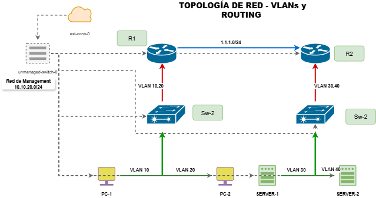

### 🏢 Network Device Backups and Simple Topology (Cisco CML Topology)

Este laboratorio posee una topología sencilla simulada en el entorno sandbox por defecto de Cisco Modeling Labs (CML). Los dispositivos cuentan con configuraciones adicionales y un script de automatización desarrollado en Python y Netmiko para el respaldo automático de la configuración global de la infraestructura.

---

### 🎯 Objetivos del Laboratorio

- ✅ Segmentar la red en VLANs para separar departamentos.
- ✅ Implementar enrutamiento OSPF para comunicación entre VLANs.
- ✅ Configurar Router-on-a-Stick con subinterfaces.
- ✅ Proveer servicios DHCP y NAT para acceso a internet.
- ✅ Asegurar los puertos de acceso con Port-Security.
- ✅ Implementar IPv6 con DHCPv6 y OSPFv3.
- ✅ Automatizar copias de seguridad (backups) con Python y Netmiko.

---

### 📊 Topología de la Red

Esta red está diseñada con la arquitectura de core colapsado (Acceso, Distribución/Core y Routers de borde) garantizando tolerancia a fallos.



---

### 🌐 Arquitectura de Red (Plano de Datos y Plano de Gestión)

Esta topología utiliza un **Unmanaged Switch** exclusivamente para la **red de gestión (Out-of-Band Management)**. Todas las interfaces de administración de los dispositivos (R1, R2, SW1, SW2, PCs y Servidores) están conectadas a este switch, el cual asigna las direcciones IP del segmento `10.10.20.0/24` para permitir el acceso remoto seguro vía SSH o Telnet (credenciales cisco/cisco). 

El tráfico de datos de los usuarios viaja de forma totalmente independiente a través de las interfaces físicas dedicadas (segmentos `192.168.x.x` y `1.1.1.x`), garantizando que la administración de los equipos no interfiera con el rendimiento de la red de producción.

---

## 📂 Estructura del Repositorio

* `Código_Automatización_backups/`: Contiene el script de Python utilizando la librería Netmiko para la ejecución y guardado de las configuraciones de los dispositivos de red.
* `configs/`: Contiene los archivos de configuración individual listos para cargar vía consola o SSH en los equipos de CML2.
  * `Sw1.txt`, `Sw2.txt`
  * `R1.txt`, `R2.txt`
  * `Host.txt`
* `Notas/`: Explicación detallada de las configuraciones aplicadas en los dispositivos.
* `Topologia/`: Imágenes de la topología en ejecución dentro del simulador.

---

## 🛠️ Requisitos en los Dispositivos de Red

* **SSH Habilitado**: Netmiko utiliza SSH por defecto; Telnet no se recomienda por razones de seguridad.
* **Usuario Local**: Cuenta con credenciales válidas creadas de forma local en el dispositivo o en un servidor AAA.
* **Privilegios de Lectura**: El usuario requiere un nivel de privilegio suficiente para ejecutar comandos `show` (ej. Nivel 1 o superior en Cisco).
* **Contraseña de Enable**: Requerida si el usuario no ingresa directamente al modo privilegiado al iniciar sesión.
* **Llaves Criptográficas**: SSH requiere que el dispositivo tenga generado su par de llaves RSA (mínimo 1024 bits).

---

## 🚀 Cómo Ejecutar el Script de Automatización

```bash
# 1. Instalar Netmiko
pip install netmiko

# 2. Ejecutar el script
python automatizacion_dos.py

# 3. Verificar los backups generados
ls ~/Desktop/Backup_Dispositivos_Laboratorio/
